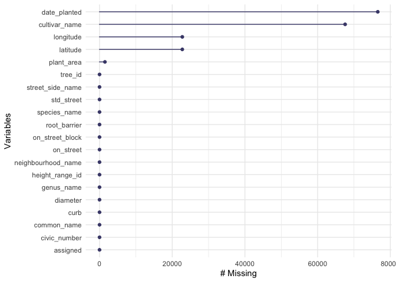
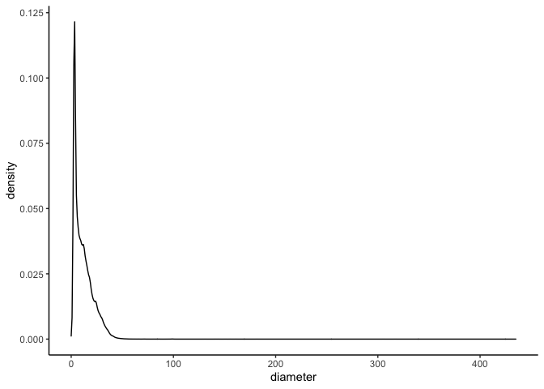
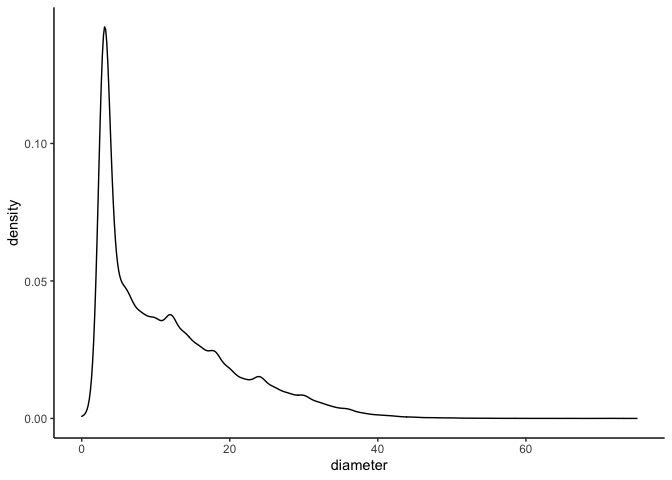
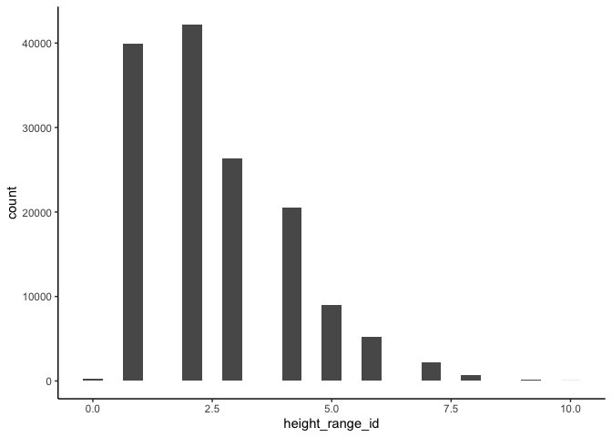
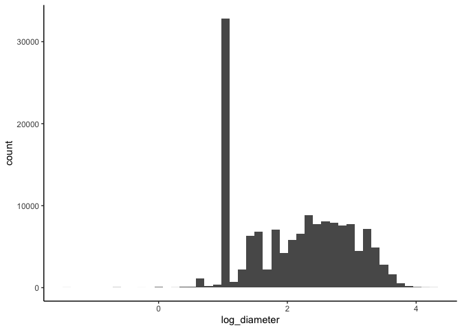
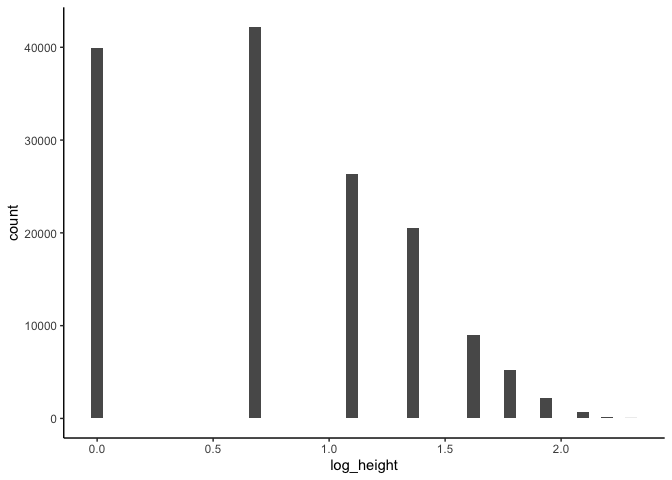
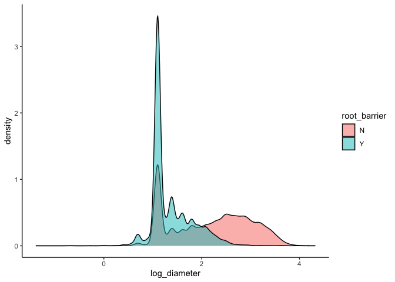

Mini data analysis: Milestone 1
================
Katie Tjaden-McClement
October 12, 2021

-   [Introduction](#introduction)
-   [**Task 1**](#task-1)
    -   [1.1 Initial Dataset Selection](#11-initial-dataset-selection)
    -   [1.2 Dataset Exploration](#12-dataset-exploration)
    -   [1.3 Narrowing down dataset
        choice](#13-narrowing-down-dataset-choice)
    -   [1.4 Potential research
        questions](#14-potential-research-questions)
-   [**Task 2**](#task-2)
    -   [Excercise 1: Visualize missing
        values](#excercise-1-visualize-missing-values)
    -   [Excercise 2: Distribution of tree size
        metrics](#excercise-2-distribution-of-tree-size-metrics)
    -   [Excercise 3: Log-transforming size
        metrics](#excercise-3-log-transforming-size-metrics)
    -   [Excercise 4: Relationship between root\_barrier and
        diameter](#excercise-4-relationship-between-root_barrier-and-diameter)
-   [**Task 3**](#task-3)

### Introduction

This is the R markdown document for the first milestone of the mini data
analysis project. This milestone of this project for STAT 545 aims to
build familiarity with the R tidyverse for data tidying, visualization,
and developing research questions. The datasets explored for this
analysis come from the *datateachr* package. Data exploration and
visualization will be conducted primarily using packages within the
*tidyverse* and include *dplyr* functions and *ggplot2*.

## **Task 1**

### 1.1 Initial Dataset Selection

The following 4 datasets were most interesting to me based on their
brief descriptions:

1.  vancouver\_trees
2.  cancer\_sample
3.  flow\_sample
4.  steam\_games

### 1.2 Dataset Exploration

Initial exploration of the above 4 datasets can be done using the tidy
function *glimpse* to display the numbers of rows and columns, column
names and classes, and the first rows of data

``` r
glimpse(vancouver_trees)
```

    ## Rows: 146,611
    ## Columns: 20
    ## $ tree_id            <dbl> 149556, 149563, 149579, 149590, 149604, 149616, 149…
    ## $ civic_number       <dbl> 494, 450, 4994, 858, 5032, 585, 4909, 4925, 4969, 7…
    ## $ std_street         <chr> "W 58TH AV", "W 58TH AV", "WINDSOR ST", "E 39TH AV"…
    ## $ genus_name         <chr> "ULMUS", "ZELKOVA", "STYRAX", "FRAXINUS", "ACER", "…
    ## $ species_name       <chr> "AMERICANA", "SERRATA", "JAPONICA", "AMERICANA", "C…
    ## $ cultivar_name      <chr> "BRANDON", NA, NA, "AUTUMN APPLAUSE", NA, "CHANTICL…
    ## $ common_name        <chr> "BRANDON ELM", "JAPANESE ZELKOVA", "JAPANESE SNOWBE…
    ## $ assigned           <chr> "N", "N", "N", "Y", "N", "N", "N", "N", "N", "N", "…
    ## $ root_barrier       <chr> "N", "N", "N", "N", "N", "N", "N", "N", "N", "N", "…
    ## $ plant_area         <chr> "N", "N", "4", "4", "4", "B", "6", "6", "3", "3", "…
    ## $ on_street_block    <dbl> 400, 400, 4900, 800, 5000, 500, 4900, 4900, 4900, 7…
    ## $ on_street          <chr> "W 58TH AV", "W 58TH AV", "WINDSOR ST", "E 39TH AV"…
    ## $ neighbourhood_name <chr> "MARPOLE", "MARPOLE", "KENSINGTON-CEDAR COTTAGE", "…
    ## $ street_side_name   <chr> "EVEN", "EVEN", "EVEN", "EVEN", "EVEN", "ODD", "ODD…
    ## $ height_range_id    <dbl> 2, 4, 3, 4, 2, 2, 3, 3, 2, 2, 2, 5, 3, 2, 2, 2, 2, …
    ## $ diameter           <dbl> 10.00, 10.00, 4.00, 18.00, 9.00, 5.00, 15.00, 14.00…
    ## $ curb               <chr> "N", "N", "Y", "Y", "Y", "Y", "Y", "Y", "Y", "Y", "…
    ## $ date_planted       <date> 1999-01-13, 1996-05-31, 1993-11-22, 1996-04-29, 19…
    ## $ longitude          <dbl> -123.1161, -123.1147, -123.0846, -123.0870, -123.08…
    ## $ latitude           <dbl> 49.21776, 49.21776, 49.23938, 49.23469, 49.23894, 4…

``` r
glimpse(cancer_sample)
```

    ## Rows: 569
    ## Columns: 32
    ## $ ID                      <dbl> 842302, 842517, 84300903, 84348301, 84358402, …
    ## $ diagnosis               <chr> "M", "M", "M", "M", "M", "M", "M", "M", "M", "…
    ## $ radius_mean             <dbl> 17.990, 20.570, 19.690, 11.420, 20.290, 12.450…
    ## $ texture_mean            <dbl> 10.38, 17.77, 21.25, 20.38, 14.34, 15.70, 19.9…
    ## $ perimeter_mean          <dbl> 122.80, 132.90, 130.00, 77.58, 135.10, 82.57, …
    ## $ area_mean               <dbl> 1001.0, 1326.0, 1203.0, 386.1, 1297.0, 477.1, …
    ## $ smoothness_mean         <dbl> 0.11840, 0.08474, 0.10960, 0.14250, 0.10030, 0…
    ## $ compactness_mean        <dbl> 0.27760, 0.07864, 0.15990, 0.28390, 0.13280, 0…
    ## $ concavity_mean          <dbl> 0.30010, 0.08690, 0.19740, 0.24140, 0.19800, 0…
    ## $ concave_points_mean     <dbl> 0.14710, 0.07017, 0.12790, 0.10520, 0.10430, 0…
    ## $ symmetry_mean           <dbl> 0.2419, 0.1812, 0.2069, 0.2597, 0.1809, 0.2087…
    ## $ fractal_dimension_mean  <dbl> 0.07871, 0.05667, 0.05999, 0.09744, 0.05883, 0…
    ## $ radius_se               <dbl> 1.0950, 0.5435, 0.7456, 0.4956, 0.7572, 0.3345…
    ## $ texture_se              <dbl> 0.9053, 0.7339, 0.7869, 1.1560, 0.7813, 0.8902…
    ## $ perimeter_se            <dbl> 8.589, 3.398, 4.585, 3.445, 5.438, 2.217, 3.18…
    ## $ area_se                 <dbl> 153.40, 74.08, 94.03, 27.23, 94.44, 27.19, 53.…
    ## $ smoothness_se           <dbl> 0.006399, 0.005225, 0.006150, 0.009110, 0.0114…
    ## $ compactness_se          <dbl> 0.049040, 0.013080, 0.040060, 0.074580, 0.0246…
    ## $ concavity_se            <dbl> 0.05373, 0.01860, 0.03832, 0.05661, 0.05688, 0…
    ## $ concave_points_se       <dbl> 0.015870, 0.013400, 0.020580, 0.018670, 0.0188…
    ## $ symmetry_se             <dbl> 0.03003, 0.01389, 0.02250, 0.05963, 0.01756, 0…
    ## $ fractal_dimension_se    <dbl> 0.006193, 0.003532, 0.004571, 0.009208, 0.0051…
    ## $ radius_worst            <dbl> 25.38, 24.99, 23.57, 14.91, 22.54, 15.47, 22.8…
    ## $ texture_worst           <dbl> 17.33, 23.41, 25.53, 26.50, 16.67, 23.75, 27.6…
    ## $ perimeter_worst         <dbl> 184.60, 158.80, 152.50, 98.87, 152.20, 103.40,…
    ## $ area_worst              <dbl> 2019.0, 1956.0, 1709.0, 567.7, 1575.0, 741.6, …
    ## $ smoothness_worst        <dbl> 0.1622, 0.1238, 0.1444, 0.2098, 0.1374, 0.1791…
    ## $ compactness_worst       <dbl> 0.6656, 0.1866, 0.4245, 0.8663, 0.2050, 0.5249…
    ## $ concavity_worst         <dbl> 0.71190, 0.24160, 0.45040, 0.68690, 0.40000, 0…
    ## $ concave_points_worst    <dbl> 0.26540, 0.18600, 0.24300, 0.25750, 0.16250, 0…
    ## $ symmetry_worst          <dbl> 0.4601, 0.2750, 0.3613, 0.6638, 0.2364, 0.3985…
    ## $ fractal_dimension_worst <dbl> 0.11890, 0.08902, 0.08758, 0.17300, 0.07678, 0…

``` r
glimpse(flow_sample)
```

    ## Rows: 218
    ## Columns: 7
    ## $ station_id   <chr> "05BB001", "05BB001", "05BB001", "05BB001", "05BB001", "0…
    ## $ year         <dbl> 1909, 1910, 1911, 1912, 1913, 1914, 1915, 1916, 1917, 191…
    ## $ extreme_type <chr> "maximum", "maximum", "maximum", "maximum", "maximum", "m…
    ## $ month        <dbl> 7, 6, 6, 8, 6, 6, 6, 6, 6, 6, 6, 7, 6, 6, 6, 7, 5, 7, 6, …
    ## $ day          <dbl> 7, 12, 14, 25, 11, 18, 27, 20, 17, 15, 22, 3, 9, 5, 14, 5…
    ## $ flow         <dbl> 314, 230, 264, 174, 232, 214, 236, 309, 174, 345, 185, 24…
    ## $ sym          <chr> NA, NA, NA, NA, NA, NA, NA, NA, NA, NA, NA, NA, NA, NA, N…

``` r
glimpse(steam_games)
```

    ## Rows: 40,833
    ## Columns: 21
    ## $ id                       <dbl> 1, 2, 3, 4, 5, 6, 7, 8, 9, 10, 11, 12, 13, 14…
    ## $ url                      <chr> "https://store.steampowered.com/app/379720/DO…
    ## $ types                    <chr> "app", "app", "app", "app", "app", "bundle", …
    ## $ name                     <chr> "DOOM", "PLAYERUNKNOWN'S BATTLEGROUNDS", "BAT…
    ## $ desc_snippet             <chr> "Now includes all three premium DLC packs (Un…
    ## $ recent_reviews           <chr> "Very Positive,(554),- 89% of the 554 user re…
    ## $ all_reviews              <chr> "Very Positive,(42,550),- 92% of the 42,550 u…
    ## $ release_date             <chr> "May 12, 2016", "Dec 21, 2017", "Apr 24, 2018…
    ## $ developer                <chr> "id Software", "PUBG Corporation", "Harebrain…
    ## $ publisher                <chr> "Bethesda Softworks,Bethesda Softworks", "PUB…
    ## $ popular_tags             <chr> "FPS,Gore,Action,Demons,Shooter,First-Person,…
    ## $ game_details             <chr> "Single-player,Multi-player,Co-op,Steam Achie…
    ## $ languages                <chr> "English,French,Italian,German,Spanish - Spai…
    ## $ achievements             <dbl> 54, 37, 128, NA, NA, NA, 51, 55, 34, 43, 72, …
    ## $ genre                    <chr> "Action", "Action,Adventure,Massively Multipl…
    ## $ game_description         <chr> "About This Game Developed by id software, th…
    ## $ mature_content           <chr> NA, "Mature Content Description  The develope…
    ## $ minimum_requirements     <chr> "Minimum:,OS:,Windows 7/8.1/10 (64-bit versio…
    ## $ recommended_requirements <chr> "Recommended:,OS:,Windows 7/8.1/10 (64-bit ve…
    ## $ original_price           <dbl> 19.99, 29.99, 39.99, 44.99, 0.00, NA, 59.99, …
    ## $ discount_price           <dbl> 14.99, NA, NA, NA, NA, 35.18, 70.42, 17.58, N…

### 1.3 Narrowing down dataset choice

After getting a better sense of the different datasets, I am most
interested in continuing to explore the *vancouver\_trees* and
*cancer\_sample* datasets. These daatsets were most interesting to me
initially based on their subject matter, since I am a biology student
and both these daatsets relate to biology. Additionally, I am starting
to form several ideas about potential research questions to address
using these datasets after viewing the column names and data types
available. I am not as excited about *flow\_sample* and *steam\_games*
because they align less with my interests generally and contain few
numerical variables of interest to me.

Looking at a more detailed breakdown of these final 2 datasets using the
*summary* function provides more information about the distribution of
numeric variables, as well as revealing more clearly that some variables
are currently mis-classed in the case of the *vancouver\_trees* dataset
(e.g. root\_barrier should be a factor not a character).

``` r
summary(vancouver_trees)
summary(cancer_sample)
# results are hidden for conciseness
```

### 1.4 Potential research questions

Research questions I would be interested in exploring with my final 2
candidate datasets are:

-   *vancouver\_trees*: Does the presence of a root barrier affect the
    size of trees, as reflected by the height range and diameter?
-   *cancer\_sample*: Is the diagnosis of malignant or benign predicted
    by the sample’s area, level of smoothness, and/or level of
    compactness?

**Final Choice**: I am choosing the *vancouver\_trees* dataset for my
mini data analysis because I am most interested in the potential
research questions it will allow me to explore.

## **Task 2**

Before diving into exploring the *vancouver\_trees* dataset I read
through the [dataset
documentation](https://opendata.vancouver.ca/explore/dataset/street-trees/information/?disjunctive.species_name&disjunctive.common_name&disjunctive.height_range_id)
to get a clearer understanding of what the different variables are and
how the data was collected.

I will also load the dataset into my R environment, renaming it to the
more concise name “trees” and change the class of the root\_barrier
variable to a factor as noted above.

``` r
trees <- vancouver_trees

trees$root_barrier <- as.factor(trees$root_barrier)
```

### Excercise 1: Visualize missing values

Knowing how many missing values there are throughout the dataset is
important. The [nanier](https://github.com/njtierney/naniar) package was
designed to easily count and visualize missing values. The function
*gg\_miss\_var* plots the number of missing values across all variables
in a dataset:

``` r
gg_miss_var(trees)
```

<!-- -->

The trees dataset isn’t missing any data for the variables of interest I
initially identified: root\_barrier, diameter, and height\_range\_id,
but is missing significant numbers of data on the date the trees were
planted, the cultivar, and geographic information (lat and long) to a
lesser extent.

### Excercise 2: Distribution of tree size metrics

Diameter and tree height are the numeric variables I am interested in
using to answer my initial research question, so I am plotting their
distributions.

-   diameter:

``` r
ggplot(trees, aes(x = diameter)) +
  geom_density() 
```

<!-- -->

The diameters of trees in this dataset right-skewed, with a very long
tail to the right as visible in the above density plot. Many models will
assume that data is normally distributed, so this could be an issue when
trying to answer research questions that involve diameter.

Based on the extremity of the largest outliers in diameter, I am going
to trim this dataset to include only trees with diameters less than 75
inches. This only removes 35 of almost 150,000 total trees in the
dataset and should avoid any of these outliers having a disproportionate
impact in future modelling.

``` r
trees_trimmed <- filter(trees, diameter <= 75)
nrow(trees) - nrow(trees_trimmed) # 35 trees trimmed from dataset
```

    ## [1] 35

``` r
ggplot(trees_trimmed, aes(x = diameter)) +
  geom_density() # reduces severity of right-skew
```

<!-- -->

``` r
trees <- trees_trimmed # saving as "trees" again to shorten object name going forward
```

-   height:

``` r
ggplot(trees, aes(x = height_range_id)) +
  geom_histogram(bins = 25)
```

<!-- -->

Height is also right-skewed, though to a lesser extent than diameter.
Because the hieght data is already binned into 10 height range
categories, with the final catergory being trees 100+ meters tall, any
outliners in height are already accounted for in this grouping, and so
won’t have a detrimental effect when using height to answer research
questions.

### Excercise 3: Log-transforming size metrics

Creating new variables in the trees dataset of log transformed diameter
and height may solve the problems of the right-skew we found above.
Let’s use mutate to create new columns that are the log of diameter and
height and check out their distributions using histograms again.

``` r
trees <- trees %>% 
  mutate(log_diameter = log(diameter),
         log_height = log(height_range_id))

ggplot(trees, aes(log_diameter)) + 
  geom_histogram(bins = 45)
```

<!-- -->

The distribution of log\_diameter is no longer right skewed, but the
variable is still not normally distributed, with a massive peak at
around 1.

``` r
ggplot(trees, aes(log_height)) + 
  geom_histogram(bins = 45)
```

<!-- -->

The distribution of log\_hieght is still right-skewed, so
log-transforming height\_range\_id was not effective in creating a more
normal distribution for height.

### Excercise 4: Relationship between root\_barrier and diameter

I am interested in evaluating the presence of root barriers to predict
tree size, so I first want to look into the frequency of root barriers
in the dataset. Is there a large enough sample of trees with and without
root barriers to ask questions about their effect?

``` r
summary(trees$root_barrier)
```

    ##      N      Y 
    ## 137422   9154

There are almost 10,000 trees with root barriers, which is a large
enough sample size to continue with investigations of their effects.

Using the log\_diameter variable I created in the previous step (because
it is more normally distributed than the original diameter variable) I
want to visualize the relationship between root barriers and tree
diameter using a density plot:

``` r
ggplot(trees, aes(x = log_diameter)) + 
  geom_density(aes(fill = root_barrier), alpha = 0.5)
```

<!-- -->

This exploratory plot of the relationship between root barriers and log
diameter shows that trees without root barriers tend to have a longer
diameter.

## **Task 3**

Research questions to answer with the *vancouver\_trees* data:

1.  How does having a root barrier relate to tree size as measured by
    diameter and height?
    -   This was my initial question after glimpsing the dataset, and
        after the exploration above I think this is an intriguing
        question to continue to explore.
2.  How does tree biomass (measured as a combination of number of trees
    and their size) vary across neighbourhoods?
    -   In walking around Vancouver, there seem to be some
        neighbourhoods with many large, old trees while some other
        neighbourhoods seem to have only few and/or very small trees. I
        would like to see if this observation holds up in the data, and
        which neighbourhoods have the most trees.
3.  What is the spatial distribution of cherry trees in Vancouver?
    -   Since this dataset contains latitude and longitude information
        for (most of) the trees, I would love to take advantage of this
        to dive into some R Spatial work, with the added benefit of
        finding out where the highest concentrations of cherry trees are
        in the city for prime springtime cherry blossom viewing.
    -   The following code chunk subsets the trees dataset to just
        cherry trees (based on having the word “cherry” in the common
        name) - there are 40 different species fo cherry trees in this
        dataset!

    ``` r
    cherry_trees <- trees %>% 
      filter(grepl("CHERRY", common_name))

    length(unique(cherry_trees$common_name))
    ```

        ## [1] 40
4.  What is the relationship between plant\_area (whether the tree is in
    a sidewalk cutout, gate, behind sidewalk, or in boulevards or
    varying widths) and tree size as measured by diameter and height?
    -   I am interested in knowing whether trees in grates or cutouts,
        for example, tend to be smaller than those on boulevards, and
        within trees on boulevards if they tend to increase in size with
        increasing boulevard width. In a dressing this question it would
        also be interesting to explore whether certain plant\_area
        categories are more likely to have root barriers in place,
        relating back to question 1.
