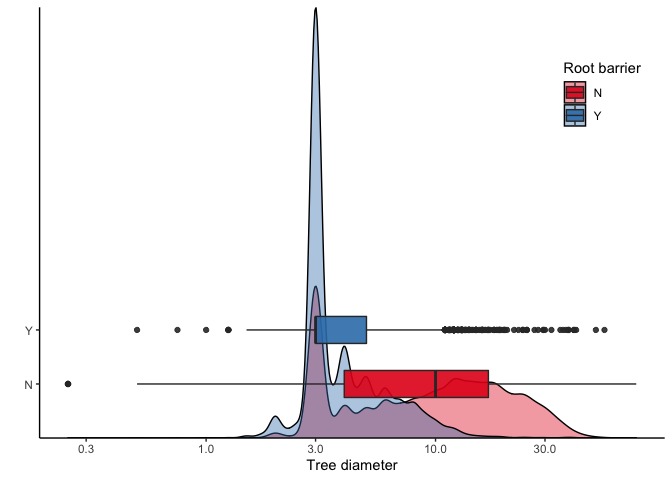
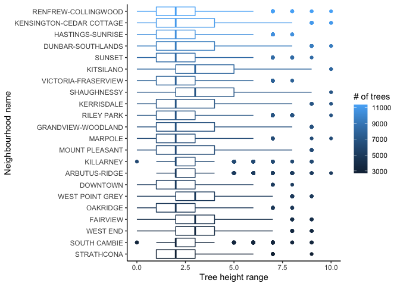
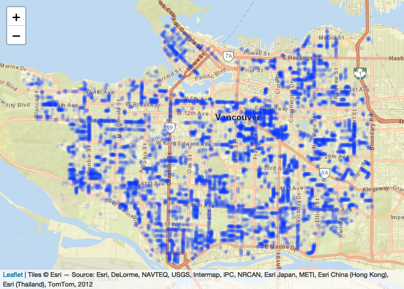
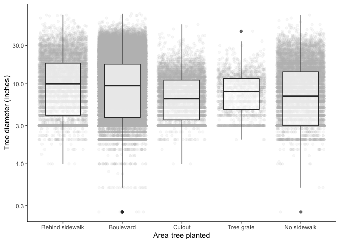

Mini Data Analysis: Milestone 2
================
Katie Tjaden-McClement
October 19, 2021

-   [Introduction](#introduction)
-   [**Task 1**](#task-1)
    -   [1.1 Research Questions](#11-research-questions)
    -   [1.2 Summarizing & Graphing](#12-summarizing--graphing)
        -   [1.2.1 Root barriers vs. tree
            size](#121-root-barriers-vs-tree-size)
        -   [1.2.2 Tree biomass across
            neighbourhoods](#122-tree-biomass-across-neighbourhoods)
        -   [1.2.3 Distribution of cherry
            trees](#123-distribution-of-cherry-trees)
        -   [1.2.4 Tree area vs. size](#124-tree-area-vs-size)
    -   [1.3](#13)
-   [**Task 2**](#task-2)
    -   [2.1 Is my data tidy?](#21-is-my-data-tidy)

### Introduction

This is the R markdown document for milestone 2 of the mini data
analysis project for STAT 545A. This milestone of the project builds on
the work done in the first milestone (*MDA\_m1.Rmd*) to gain experience
working with *dplyr* and *tidyr* to handle datasets and adress research
questions. This milestone focuses on the principle of tidy data and how
datasets can be converted to tidy formats for a given research question.

In Milestone 1 I chose the *vancouver\_trees* dataset from the
*datateachr* package to work with for the Mini Data Analysis, and
explored it through various visualizations.

## **Task 1**

### 1.1 Research Questions

These are the 4 research questions I proposed for the *vancouver\_trees*
dataset in milestone 1:

1.  How does having a root barrier relate to tree size as measured by
    diameter and height?
2.  How does tree biomass (measured as a combination of number of trees
    and their size) vary across neighbourhoods?
3.  What is the spatial distribution of cherry trees in Vancouver?
4.  What is the relationship between plant\_area (whether the tree is in
    a sidewalk cutout, gate, behind sidewalk, or in boulevards or
    varying widths) and tree size as measured by diameter and height?

Before getting into processing and summarizing my data, I will load it
into my R environment using the more concise name “trees”. I will also
trim outliers for diameter as discuessed in milestone 1.

``` r
trees <- vancouver_trees
trees <- filter(trees, diameter <= 75)
```

### 1.2 Summarizing & Graphing

#### 1.2.1 Root barriers vs. tree size

To summarize the data for question 1, I will compute the range, mean,
median, and standard deviation of tree diameter for trees with and
without root barriers

``` r
q1_summary <- trees %>% 
  group_by(root_barrier) %>% 
  summarise(mean = mean(diameter, na.rm = T),
            range_lower = min(diameter),
            range_upper = max(diameter),
            median = median(diameter, na.rm = T),
            sd = sd(diameter),
            n = n())
q1_summary
```

    ## # A tibble: 2 × 7
    ##   root_barrier  mean range_lower range_upper median    sd      n
    ##   <chr>        <dbl>       <dbl>       <dbl>  <dbl> <dbl>  <int>
    ## 1 N            11.9          0          75       10  9.03 137422
    ## 2 Y             4.38         0.5        54.5      3  2.75   9154

Hmm we can see from the minimum that there are trees with a diameter of
0, which can’t be right. Let’s see how many there are and remove them
from the dataset

``` r
diameter0 <- filter(trees, diameter == 0)
nrow(diameter0) # there are 92!
```

    ## [1] 92

``` r
trees <- filter(trees, diameter != 0)
```

Now lets repeat the summary statistics:

``` r
q1_summary <- trees %>% 
  group_by(root_barrier) %>% 
  summarise(mean = mean(diameter, na.rm = T),
            range_lower = min(diameter),
            range_upper = max(diameter),
            median = median(diameter, na.rm = T),
            sd = sd(diameter),
            n = n())
q1_summary
```

    ## # A tibble: 2 × 7
    ##   root_barrier  mean range_lower range_upper median    sd      n
    ##   <chr>        <dbl>       <dbl>       <dbl>  <dbl> <dbl>  <int>
    ## 1 N            11.9         0.25        75       10  9.03 137330
    ## 2 Y             4.38        0.5         54.5      3  2.75   9154

Let’s visualize these differences in diameter between trees with and
without root barriers using a boxplot overlayed with density plots to
get a better sense of the full spread of the data

``` r
ggplot(trees) +
  geom_density(aes(x = diameter, fill = root_barrier), 
              alpha = 0.4) +
  geom_boxplot(aes(x = diameter, y = root_barrier, fill = root_barrier), 
               width = 0.5, alpha = 0.9) +
  scale_x_log10() + # changes the x axis to a logarithmic scale which more clearly shows the distribution
  scale_fill_brewer(palette = "Set1") + # specifies a colour palette from the rcolourbrewer package (in tidyverse)
  labs(x = "Tree diameter",
       fill = "Root barrier",
       y = "") + # removes y axis label because it is redundant to fill label
  theme(legend.position = c(0.9, 0.8)) # positions the legend in the top right corner of the graph that was blank space anyway
```

<!-- -->

#### 1.2.2 Tree biomass across neighbourhoods

To look at how tree biomass varies across neighbourhoods, I will find
out how many observations (= number of trees, since each row of the data
frame is a different tree) there are across the different
neighbourhoods. Since I want to measure biomass, which is a combination
of tree sizes and number of trees, this will give me an idea of how many
trees are in each neighbourhood, but won’t get at the total biomass yet.

``` r
(trees_neighbourhood <- trees %>% 
  group_by(neighbourhood_name) %>% 
  summarise(n = n()))
```

    ## # A tibble: 22 × 2
    ##    neighbourhood_name           n
    ##    <chr>                    <int>
    ##  1 ARBUTUS-RIDGE             5166
    ##  2 DOWNTOWN                  5157
    ##  3 DUNBAR-SOUTHLANDS         9392
    ##  4 FAIRVIEW                  4001
    ##  5 GRANDVIEW-WOODLAND        6699
    ##  6 HASTINGS-SUNRISE         10544
    ##  7 KENSINGTON-CEDAR COTTAGE 11033
    ##  8 KERRISDALE                6931
    ##  9 KILLARNEY                 6142
    ## 10 KITSILANO                 8105
    ## # … with 12 more rows

``` r
mean(trees_neighbourhood$n)
```

    ## [1] 6658.364

``` r
max(trees_neighbourhood$n)
```

    ## [1] 11380

Of the 22 neighborhoods in this dataset, all have at least 2500 trees,
with an average of 6658 trees and a maximum of just over 11 000 trees in
Renfrew-Collingwood.

Let’s look at the average heights of trees across neighbourhoods, first
sorting the neighbourhood name factor from least to most trees to better
see any trends in tree height and number of trees in neighbourhood

``` r
trees %>% 
  mutate(neighbourhood_name = fct_rev(fct_infreq(neighbourhood_name))) %>% #reorder the factor by increasing frequency of neighbourhood
  group_by(neighbourhood_name) %>% 
  mutate(neighbourhood_count = n()) %>% # add a column to the tibble with tree count for each neighbouhood
  ggplot(aes(x = neighbourhood_name, y = height_range_id,
             colour = neighbourhood_count), # colour with a continuous scale according to # of trees in the neighbourhood
         alpha = 0.1) +
  geom_boxplot() +
  coord_flip() + # flips the x and y axes so that the neighbourhood names fit
  labs(y = "Tree height range", x = "Neighbourhood name",
       colour = "# of trees")
```

<!-- -->

There does not seem to be a relationship between number of trees and
tree height in a neighbourhood.

#### 1.2.3 Distribution of cherry trees

First I need to subset the dataset to just cherry trees based on whether
they have “Cherry” in the common name.

``` r
cherry <- trees %>% 
     filter(grepl("CHERRY", common_name), # the grepl function evaluates whether the string of characters "CHERRY" appears in each common name and returns a TRUE/FALSE that can be filtered by
            !is.na(longitude)) # removes entries missing longitude (and also latitude) values needed to answer the question of spatial distribution

nrow(cherry)
```

    ## [1] 15989

There are 15 989 cherry trees in the dataset.

To summarise the cherry tree data I will create a categorical variable
based on the latitude and longitude of the trees to determine which
quadrant of the city they are in (NW, NE, SW, SE). For this exercise I
will set the center of Vancouver as (49.24388553259791,
-123.13716749250246).

``` r
cherry <- cherry %>% 
  mutate(quadrant = case_when((latitude > 49.24388553259791 & 
                               longitude < -123.13716749250246) ~ "NW",
                              (latitude > 49.24388553259791 & 
                               longitude > -123.13716749250246) ~ "NE",
                              (latitude < 49.24388553259791 & 
                               longitude < -123.13716749250246) ~ "SW",
                              (latitude < 49.24388553259791 & 
                               longitude > -123.13716749250246) ~ "SE")) %>% 
  mutate(quadrant = as.factor(quadrant))

summary(cherry$quadrant)
```

    ##   NE   NW   SE   SW 
    ## 5885 2451 5377 2276

Now let’s map the locations of all the cherry trees in Vancouver using
the leaflet package. This creates an interactive map that you can
navigate by zooming in and moving around. I’ve increased the
transparency of the points and made them quite small to better show the
hotspots of density across the city.

``` r
leaflet(cherry) %>% 
  addProviderTiles(providers$Esri.WorldStreetMap) %>% 
  addCircleMarkers(lng = cherry$longitude, lat = cherry$latitude,
                   radius = 0.1, opacity = 0.1) # opacity is the same as alpha transparency
```

<!-- -->

Note: this map is interactive when created in RStudio, but only a static
version is available in the markdown document.

#### 1.2.4 Tree area vs. size

To investigate whether the area a tree is planted in affects its size, I
first need to tidy up the plant area column:

``` r
class(trees$plant_area) # this is currently a character vector
```

    ## [1] "character"

``` r
unique(trees$plant_area) # and is a mix of numbers and letters
```

    ##  [1] "N"  "4"  "B"  "6"  "3"  "5"  "2"  NA   "10" "C"  "7"  "8"  "12" "25" "40"
    ## [16] "9"  "17" "1"  "24" "11" "20" "13" "15" "16" "G"  "18" "b"  "14" "30" "c" 
    ## [31] "L"  "P"  "50" "34" "60" "M"  "21" "35" "n"  "75" "45" "19" "0"  "g"  "22"
    ## [46] "y"  "27" "32" "26"

From the [dataset
information](opendata.vancouver.ca/explore/dataset/street-trees/information/)
we know that:

-   B = behind sidewalk
-   G = in tree grate
-   N = no sidewalk
-   C = cutout
-   a number indicates boulevard width in feet

I will assume that lowercase letters are typos and should be uppercase,
but I will remove entries with letters for plant area not explained in
the dataset documentation: y, L, P, M. *Credit for the code to replace
the numbers in the column with a character goes to TA Yulia Egorova who
answered this question for another student on Slack.*

``` r
trees_area <- trees %>% 
  filter(!is.na(plant_area), # filter out any trees missing plant area information
         !(plant_area %in% c("y", "P", "L", "M"))) %>% # filter out plant area entries not in documentation
  mutate(area_factor = gsub("[^0-9.-]", "", plant_area), # replaces characters with blanks
         area_factor = ifelse(area_factor == "", plant_area,"BL"), # replaces blanks from last step with their original value, and replaces everything else (= the numbers) with "BL" for boulevard
         area_factor = toupper(area_factor), # make all letters uppercase
         area_factor = as.factor(area_factor))
```

Let’s look at the number of observations across our newly wrangled
categories for the area planted:

``` r
summary(trees_area$area_factor)
```

    ##      B     BL      C      G      N 
    ##   9043 110739   8505   1979  14046

Now let’s plot tree diameter across these categories using boxplots to
see the means and quantiles of the data as well as adding the jittered
data points behind with high transparency to show the spread of the data
and give the viewer a rough, relative idea of the number of observations
in each category. As for question 1, I made the axis with diameter
logarithmic to better see the spread of data.

``` r
ggplot(trees_area, aes(x = area_factor, y = diameter)) + 
  geom_jitter(width = 0.4, alpha = 0.1, colour = "grey") +
  geom_boxplot(width = 0.6, alpha = 0.7) +
  scale_y_log10() + # makes the y axis logarithmic
  labs(x = "Area tree planted",
       y = "Tree diameter (inches)") +
  scale_x_discrete(limits = c("B", "BL", "C", "G", "N"),
                   labels = c("Behind sidewalk", "Boulevard", 
                              "Cutout", "Tree grate", "No sidewalk")) # renames the factor codes to something meaningful for a viewer
```

<!-- -->

There doesn’t seem to be variation in tree diameter between the
different areas the trees are planted.

### 1.3

## **Task 2**

### 2.1 Is my data tidy?

Tidy data: \* each row is an observation \* each column is a variable \*
each cell is a value

To determine if the *vancouver\_trees* dataset is tidy, let’s take a
